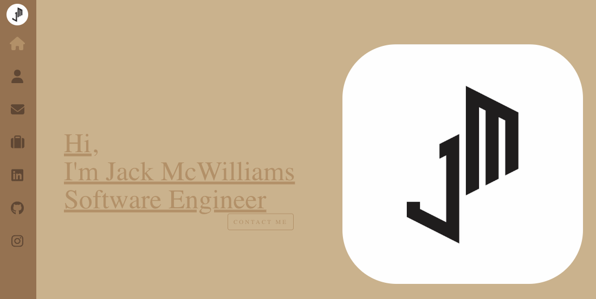

# portfolio

## Description 
Portfolios are crucial. not only does the site iteslf show off your capabilites but it is a space where you can show past work as well. Your portoflio makes it easier for future employeers to get contact informaton, see your resume, and work all in one place.

## Deployment Link:
https://mrwaynejames.github.io/portfolio/

## Usage
Use the appropriate links to maneuver through the site. 

## Webiste 

Home Page:
   

## Author
<a href="https://github.com/Mrwaynejames">GitHub</a>
